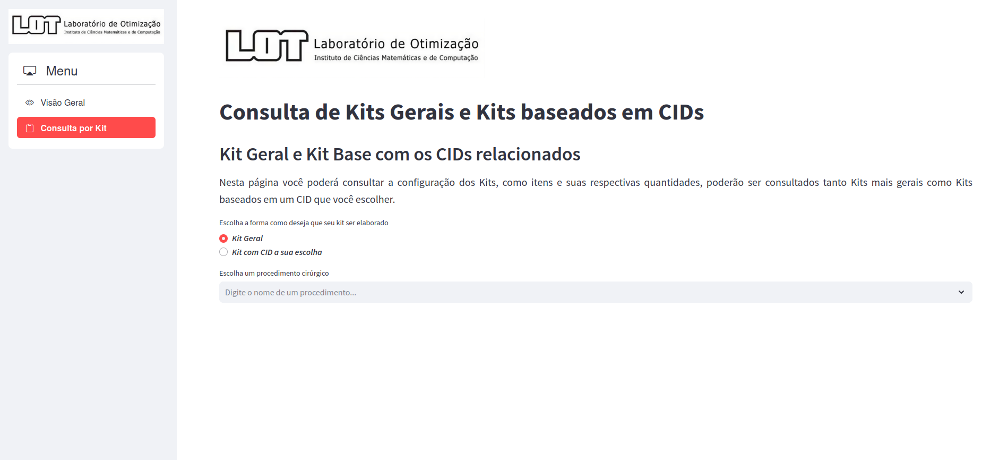

Copyright 2024 Silva M. V. 

# Otimizando a elaboração de Kits Cirúrgicos

## Este repositório contém os códigos relativos ao projeto de iniciação científica intitulado Abordagens Computacionais para Análise e Determinação de Kits Cirúrgicos fomentado pelo CNPq

O projeto, além de estar vinculado ao CNPq, também é vinculado ao Instituto de Ciências Matemáticas e de Computação (ICMC) da Universidade de São Paulo (USP). Esse tem como autor o aluno **[Marcus Vinicius da Silva](www.linkedin.com/in/silvamarcuss/)** e orientado pela porfessora **[Dra Maristela Oliveira dos Santos](www.linkedin.com/in/maristela-santos-02a18b24/)**.

### Contextualizando o Projeto

A administração de um centro cirúrgico envolve desafios complexos, exigindo soluções rápidas e eficientes. Um dos principais desafios é a gestão adequada dos recursos hospitalares, especialmente considerando que o setor cirúrgico representa a maior parte da receita de um hospital, como afirmou [Cardoen (2015)](https://www.tandfonline.com/doi/abs/10.1080/00207543.2015.1061221). Este projeto propõe a otimização da padronização de kits cirúrgicos, que são conjuntos de materiais e medicamentos utilizados em procedimentos. Os estudos realizados apontam que a utilização da Classificação Internacional de Doenças (CID) pode aprimorar a definição dos kits cirúrgicos, ajustando a quantidade e o tipo de materiais necessários com base nas causas as quais levam uma pessoa ser submetida a realização de um procedimento cirúrgico. Em resumo, neste projeto, tem-se o objetivo de obter Kits para procedimentos e seus respectivos grupos de doenças.

### Estrutura do Repositório

O repositório encontra-se organizado em alguns notebooks do Python como também há arquivos referentes as interfaces desenvolvidas ao longo do projeto. Começando por uma das principais etapas quando trata-se de trabalhar com dados, pode-se observar o que foi feito base de dados original para [filtrá-los](https://github.com/MarcussSilva/Scientific_Research/blob/main/An%C3%A1lises_2024.ipynb), como tratamento de inconsistências e dados faltantes. Após isso foi feita a verificação de que a doença a qual fez uma pessoa ser submetida a um procedimento ciúrgico afeta a configuração do Kit, assim, observou-se a [similaridade](https://github.com/MarcussSilva/Scientific_Research/blob/main/An%C3%A1lise_Similaridade.ipynb) entre Kits provenientes de um mesmo procedimento porém com CIDs diferentes. Com isso foi feita a [elaboração dos Kits](https://github.com/MarcussSilva/Scientific_Research/blob/main/kits_2024_1.ipynb) por meio de técnicas de agrupamento entre outros algoritmos complementares. E para facilitar a consulta pelos Kits e visualização dos dados, foi desenvolvida uma [interface web](https://github.com/MarcussSilva/Scientific_Research/blob/main/dash2024.py) utilizando da biblioteca [Streamlit do Python](https://docs.streamlit.io/). 

Ao observar os códigos será nítido que as versões finais dos códigos desse repositório apresentam apenas alguns dados genéricos, isso se dá pelo fato de que os dados utilizados para o desenvolvimento da iniciação científica serem de natureza sensível, pois se tratam de dados hospitalares. Ainda assim, poderá ser observada como se deu a estrutaração das funções e da interface, abaixo está um pouco de ela ficou.

#### Página inicial para visualização de procedimentos mais frequentes, doenças relacionadaas a eles e histórico de ocorrência de cirurgias de acordo com as especialidades médicas

  

#### Página para fazer as consultas por Kits cirúrgicos, levando, ou não, em consideração as doenças relacionadas ao procedimento consultado

  

